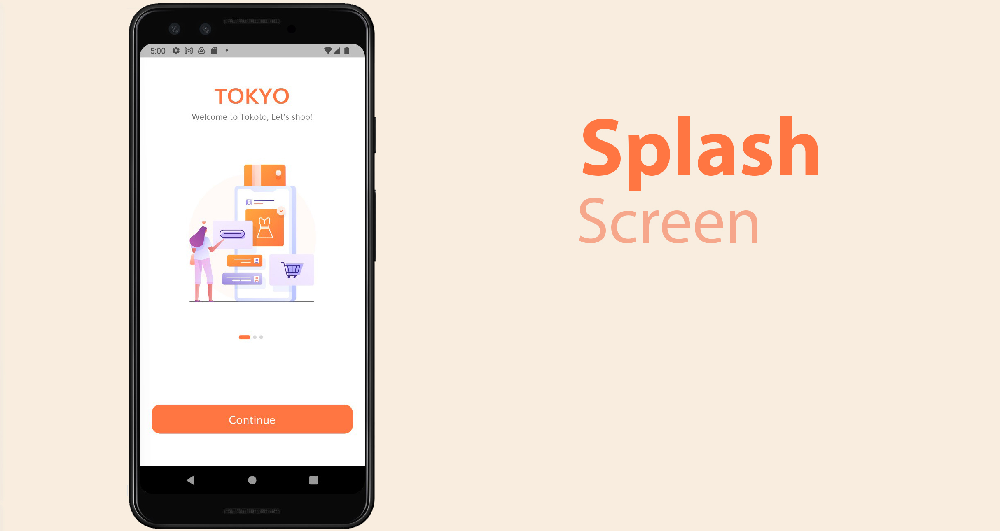
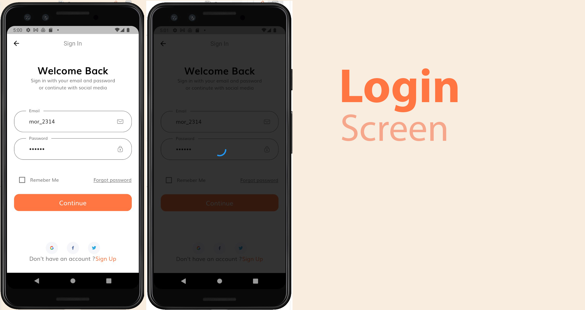
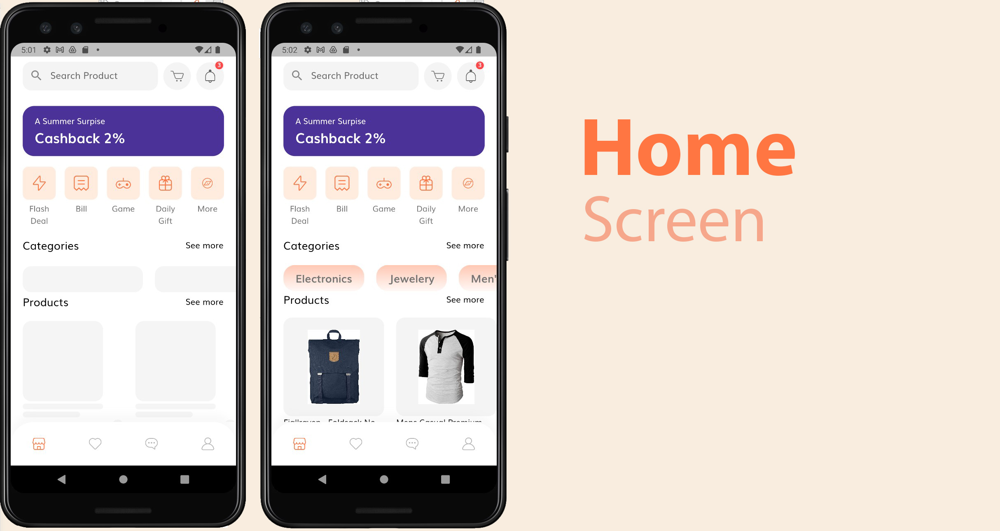
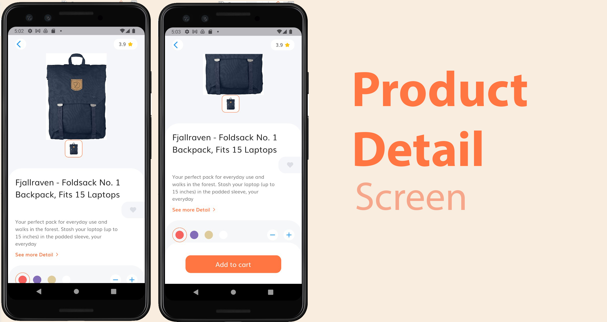
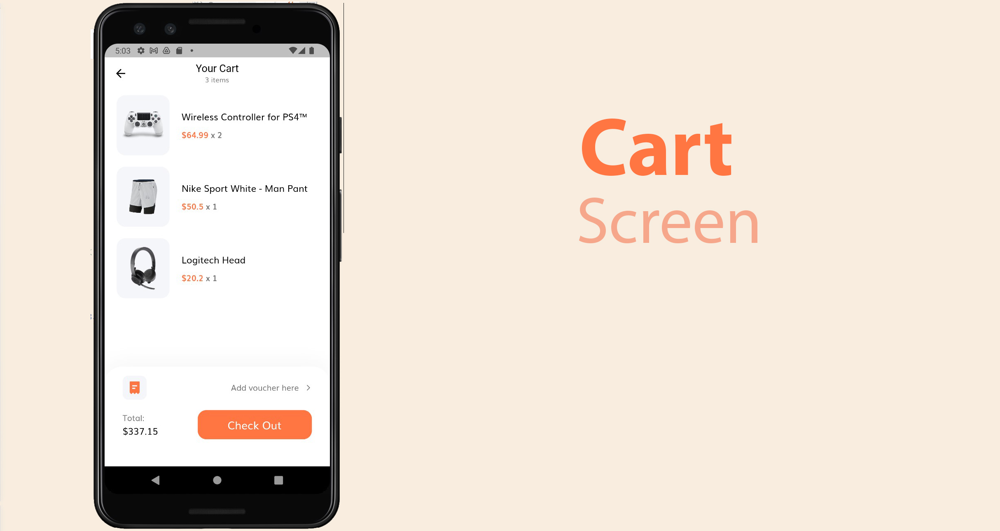
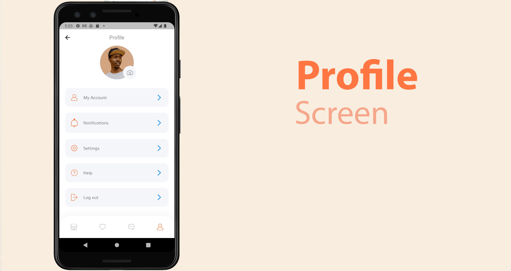
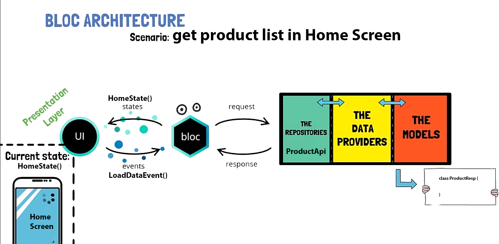

# Flutter E-Commerce App With API

If you want to learn Flutter and bloc pattern with calling restfull api, please use this code for free.

## Screens

## Bloc pattern

This application is designed in bloc pattern like following:

## Api

This application use demo api from https://fakestoreapi.com/docs